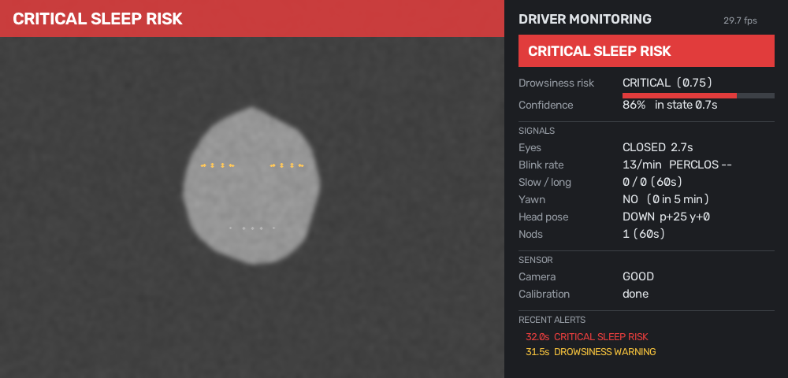
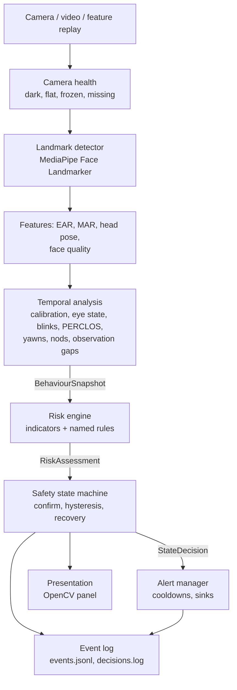
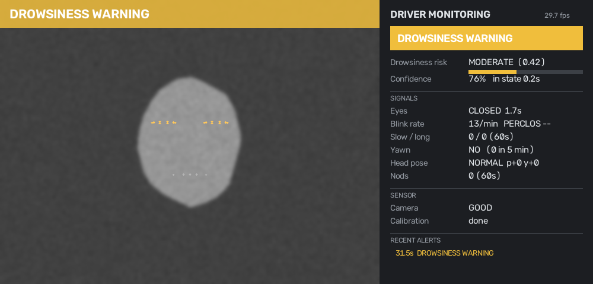
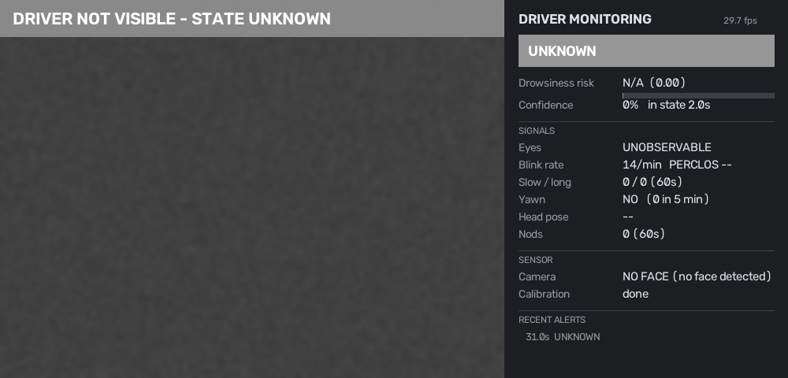

# Fleet Driver Drowsiness & Sleep Detection

An explainable, safety-oriented driver monitoring system for driver-facing fleet cameras. It watches the eyes, mouth and head over time, combines independent evidence into a transparent risk decision, and drives a hysteresis-based safety state machine that **never reports a driver as safe when it cannot see them**.


<sub>Panel rendered from the real pipeline; the face is a synthetic geometric fixture (`scripts/render_ui_preview.py`).</sub>

```
ALERT · MONITORING · DROWSINESS_WARNING · HIGH_DROWSINESS_RISK · CRITICAL_SLEEP_RISK · UNKNOWN · CAMERA_UNAVAILABLE
```

**Status:** 164 tests pass (unit, scenario and pipeline integration), plus 2 that run once the MediaPipe model is downloaded. **No real-world accuracy is claimed.** The evaluation framework is built; numbers need labelled video ([docs/EVALUATION.md](docs/EVALUATION.md)).

---

## Contents
1. [Project overview](#1-project-overview) · 2. [Problem statement](#2-problem-statement) · 3. [Fleet safety use case](#3-fleet-safety-use-case) · 4. [Architecture](#4-architecture) · 5. [Computer vision approach](#5-computer-vision-approach) · 6. [Drowsiness methodology](#6-drowsiness-detection-methodology) · 7. [Temporal analysis](#7-temporal-analysis) · 8. [Risk engine](#8-risk-engine) · 9. [State machine](#9-state-machine) · 10. [Installation](#10-installation) · 11. [Running the demo](#11-running-the-demo) · 12. [Testing](#12-testing) · 13. [Evaluation](#13-evaluation-metrics) · 14. [Example outputs](#14-example-outputs) · 15. [Limitations](#15-limitations) · 16. [Privacy](#16-privacy-considerations) · 17. [Future work](#17-future-improvements)

## 1. Project overview

| | |
|---|---|
| **Input** | Driver-facing webcam or recorded video (any laptop CPU, no GPU) |
| **Vision** | MediaPipe Face Landmarker: 478 3D landmarks plus blendshapes |
| **Signals** | EAR, PERCLOS, blink duration/rate, slow blinks, long closures, inner-lip MAR, yawns, 3D head pitch/yaw/roll, nods, signal quality |
| **Decision** | Rule-based multi-signal risk engine (named rules, evidence list) → safety state machine (confirmation, hysteresis, stepwise recovery) |
| **Outputs** | On-screen panel, console alerts, `events.jsonl` (structured), `decisions.log` (human-readable) |
| **Extensible** | `RiskModel` protocol to swap in a learned model; `AlertSink` protocol for audio/telematics |

## 2. Problem statement

Fatigue is a major factor in heavy-vehicle crashes. A drowsy driver shows a characteristic, *temporal* pattern: longer and slower blinks, a rising share of time with eyes closed (PERCLOS), yawning, head nodding, and finally microsleeps.

The difficulty is not detecting a closed eye in one frame. It is:

* separating that pattern from blinking, glancing at mirrors or the dashboard, talking, sunglasses and bad lighting;
* doing it quickly enough to matter;
* being honest when the camera simply cannot tell.

## 3. Fleet safety use case

```
Driver-facing camera ─► on-device monitor ─► in-cab warning (visual now, audio pluggable)
                                         └─► event record ─► fleet safety review / coaching
```

* **In-cab:** a short WARNING for early signs, an insistent alert for HIGH, and urgent alert plus fleet notification for CRITICAL.
* **Fleet:** structured events carry state, risk, confidence, evidence and the rule that fired. A safety manager can see *why* an event was raised, which is what makes coaching conversations fair.
* **Sensor health:** a covered or failed camera is itself a reportable event (`CAMERA_UNAVAILABLE`), not a silent "all clear".

## 4. Architecture

Detection is not decision. Each layer only depends on the layers above it.



```
src/drowsiness/
├── sources/         webcam, video file (deterministic timestamps), feature replay
├── detection/       LandmarkDetector protocol + MediaPipe implementation
├── features/        eye_metrics (EAR), mouth_metrics (MAR), head_pose, signal_quality, extractor
├── analysis/        calibration, eye_state, blink_analyzer (+PERCLOS), yawn_analyzer,
│                    head_movement, temporal_analyzer
├── safety/          risk_engine, state_machine, alert_manager
├── events/          structured JSON logging, event recorder, feature recorder, opt-in snapshots
├── presentation/    OpenCV monitoring panel
├── pipeline/        DriverMonitor: wires the layers together
├── evaluation/      frame/event metrics, subject-wise splits
├── simulation/      synthetic landmarks and feature streams (test fixtures)
├── schemas/         typed dataclasses and enums at every layer boundary
└── config/          settings.py: every threshold, with its reasoning
configs/default.yaml generated from settings.py, commented
demo/                webcam_demo.py
scripts/             download_model, evaluate, process_dataset, replay_features,
                     run_synthetic_scenarios, render_ui_preview, export_config
tests/               unit/, scenarios/, integration/
docs/                EVALUATION.md, FAILURE_MODES.md, images/
```

Design changes from the original brief, and why:

* **One landmark model, several feature extractors.** There are no separate "eye detector" and "mouth detector" models; they are geometry over one landmark set.
* **A signal-quality layer.** Every measurement can be *unobservable*, which is distinct from open or closed.
* **Per-driver calibration.** Eye shape and camera mounting vary too much for fixed thresholds.
* **Feature recording and replay.** The decision layers can be re-run on numeric features alone, with no video. This supports privacy, fast threshold tuning and deterministic tests.

## 5. Computer vision approach

| Option | Decision | Why |
|---|---|---|
| OpenCV Haar cascades | Rejected | Face boxes only; no landmarks, so no EAR, MAR or pose. |
| dlib 68-point | Rejected | Sparse eye contour gives noisy EAR; the HOG face detector fails at moderate yaw. |
| **MediaPipe Face Landmarker (Tasks API)** | **Chosen** | 478 3D landmarks with a dense eye contour, real time on CPU, and blendshape scores (`eyeBlink*`, `jawOpen`) as an independent second opinion. Apache-2.0. |
| Train a CNN on face crops | Deferred | Opaque, needs labelled data, and isn't needed for a robust first version. |

The legacy `mp.solutions.face_mesh` API has been removed from current MediaPipe releases, so the Tasks API (`FaceLandmarker`, VIDEO mode) is used.

**Head pose without camera intrinsics.** Instead of `solvePnP` against a generic 3D face model, the face's own coordinate frame is built from MediaPipe's 3D landmarks:

* X axis: eye corner to eye corner.
* Y axis: forehead to chin, orthogonalised against X.
* Z axis: X × Y.

That matrix is the head rotation; Euler angles follow directly (positive pitch = chin down). It is tested against synthetic faces with known rotations (±0.5°).

## 6. Drowsiness detection methodology

**Eyes: Eye Aspect Ratio** (Soukupová & Čech, 2016)

```
EAR = (|p2 − p6| + |p3 − p5|) / (2 · |p1 − p4|)
```

* An eye is **CLOSED** when EAR < 0.65 × the driver's calibrated open-eye EAR, and reopens above 0.75 × (per-frame hysteresis).
* The `eyeBlink` blendshape is a cross-check. Agreement keeps confidence; disagreement lowers it.
* Eyes are **UNOBSERVABLE**, never "open", when:
  * yaw or pitch exceeds 35° (EAR is geometrically invalid);
  * the eye region is much darker than the face (sunglasses or occlusion);
  * the face is too small, or there is no face.

**Blink taxonomy** (all configurable)

| Closure | Meaning |
|---|---|
| < 0.05 s | Tracker noise, discarded |
| 0.1-0.4 s | Normal blink |
| ≥ 0.5 s | Slow blink, an early drowsiness sign |
| ≥ 1.0 s | Prolonged closure |
| ≥ 3.0 s continuous | Microsleep-length, CRITICAL |

**PERCLOS** is the fraction of *observed* time with eyes closed over 60 s. It is withheld when the eyes were observable for less than 60% of the window.

**Mouth: inner-lip MAR** = mean of three vertical lip gaps ÷ mouth width. A yawn is MAR ≥ 0.5 (or `jawOpen` ≥ 0.6) sustained for ≥ 2 s. Talking and laughing are shorter and narrower.

**Head**

* All angles are relative to the driver's calibrated neutral pose.
* **Nod:** pitch rises ≥ 12° within 0.7 s. The head must return near neutral before another nod counts.
* **Head-down while eyes are not confirmed open** is drowsiness evidence.
* **Head-down with eyes open** is a dashboard or phone glance. It is logged as `eyes_off_road_s` but is not drowsiness.

**Calibration.** The first ~20 s of good-quality frames give the open-eye EAR (85th percentile, clamped to 0.18-0.42) and the neutral pose (median). Until calibration completes, the state is `MONITORING`.

## 7. Temporal analysis

```
FrameFeatures ─► calibration ─► eye state (OPEN/CLOSED/UNOBSERVABLE)
                              ├► closure episodes ─► blink rate, slow blinks, long closures, PERCLOS
                              ├► mouth episodes ───► yawns (5 min window)
                              ├► head ─────────────► nods (60 s), head-down timers, looking away
                              └► observation gaps ─► face lost, camera down, "lost right after impairment"
             ─► BehaviourSnapshot (one feature vector per frame)
```

* All durations come from timestamps, so the logic is frame-rate independent (tested at 30, 15 and 10 FPS).
* A closure that becomes unobservable survives a 0.3 s gap. After that it ends as *interrupted*, with only the observed duration counted.

## 8. Risk engine

Each signal becomes an **indicator** with severity 0-3 from configurable thresholds. **Named rules** then set the level; the first match wins.

| Level | Rule (name in output) |
|---|---|
| CRITICAL | `microsleep_length_eye_closure`: continuous closure ≥ 3 s |
| | `extreme_perclos`: PERCLOS ≥ 0.40 |
| | `eye_closure_with_head_drop`: closure ≥ 2 s **and** head down/dropping |
| HIGH | `strong_eye_evidence`: an eye indicator at severity ≥ 2 (closure ≥ 2 s, PERCLOS ≥ 0.25, ≥ 3 long closures/min) |
| | `eyes_corroborated_by_head`: eyes ≥ 1 **and** head ≥ 1 (independent categories agree) |
| | `repeated_nodding`: ≥ 3 nods/min |
| | `multiple_independent_categories`: three categories at ≥ 1 |
| MODERATE | `single_category_indicator`: any indicator at ≥ 1 |

Rules of thumb built into the engine:

* **Weak signals are capped.** Yawning, blink rate and slow blinks can never exceed MODERATE on their own.
* **The score never contradicts the level.** `risk_score` sits inside the level's band (LOW 0-0.25, MODERATE 0.25-0.5, HIGH 0.5-0.75, CRITICAL 0.75-1), positioned by how far the strongest indicator has progressed.
* **Confidence is not risk.** Confidence measures how trustworthy the observations are (frame quality, blendshape agreement, calibration), scaled by how many independent categories corroborate an elevated level.

## 9. State machine

| Behaviour | Rule |
|---|---|
| Escalation | Target level must persist: WARNING 0.5 s, HIGH 0.3 s, CRITICAL immediate (its rule already contains seconds of evidence). Levels can be skipped. |
| De-escalation | Lower risk must persist for 4 s (from CRITICAL) or 6 s (HIGH, WARNING). Then the state steps down **one** level and the timer restarts. The panel shows recovery progress. |
| History vs. now | Window evidence (PERCLOS, closure/nod/yawn counts) escalates, but stops holding an alarm once the driver has been **observed** alert for 8 s; any new sign re-activates it. Time with eyes unobservable never counts as recovery. |
| ALERT | Only when calibrated, eyes observed, and low risk confirmed for 2 s. Otherwise MONITORING. |
| Face lost < 1 s | Hold state; confidence decays. |
| Face lost ≥ 1 s | `UNKNOWN` (never ALERT). |
| Face/eyes lost right after impairment while elevated | **Hold the elevated state.** A slumping driver can leave the frame. |
| Camera failure ≥ 2 s | `CAMERA_UNAVAILABLE` |

The alert manager applies per-type cooldowns, so a flickering state does not spam the driver. CRITICAL's short cooldown is independent of the others, so a worse alert is never delayed.

## 10. Installation

Requires Python 3.11+ and a webcam for the live demo.

```bash
git clone <this repo> && cd fleet-driver-drowsiness
python -m venv .venv && source .venv/bin/activate      # Windows: .venv\Scripts\activate
pip install -r requirements.txt
pip install -e .
python scripts/download_model.py                        # MediaPipe face landmarker, ~3.6 MB
```

`mediapipe` installs `opencv-contrib-python`. Do **not** also install `opencv-python`; the two conflict.

## 11. Running the demo

```bash
python -m drowsiness                             # live monitoring on webcam 0
python demo/webcam_demo.py                       # same thing, as a script
python demo/webcam_demo.py --source drive.mp4    # recorded video
python demo/webcam_demo.py --help                # all options
```

* Look at the screen normally for ~20 s while the system calibrates. Then try:
  * a long blink;
  * closing your eyes for 2-3 s while dropping your head;
  * a yawn;
  * looking away;
  * covering the camera.
* Press `q` or `Esc` to quit.

Options:

| Flag | Effect |
|---|---|
| `--guided-demo` | On-screen prompts walk you through each behaviour; records `demo.mp4` in real time and stops by itself. |
| `--headless --timeline out.jsonl` | Process a video without a window and write a per-frame state timeline for evaluation. |
| `--record-features` | Write `logs/features.jsonl` (numbers only, no pixels) for replay. |
| `--save-snapshots` | Opt-in: save a small still on HIGH/CRITICAL alerts. |
| `--save-annotated out.mp4` | Opt-in: record the annotated video. |
| `--config my.yaml` | Override any threshold (see `configs/default.yaml`). |

## 12. Testing

```bash
pytest                                     # 164 tests, ~15 s, no camera or model needed
python scripts/run_synthetic_scenarios.py  # readable table of scenario outcomes
```

| Suite | Covers |
|---|---|
| `unit/test_config.py` | Defaults valid, YAML matches code, hysteresis/threshold ordering enforced, unknown keys rejected |
| `unit/test_features.py` | EAR/MAR exact on known geometry, roll/scale invariance, head pose recovers known rotations, camera dark/frozen/missing, sunglasses, low light, small face, occluded eye |
| `unit/test_analysis.py` | Calibration, eye-state hysteresis, per-driver thresholds, unobservable cases, blink duration/frequency/PERCLOS, frame-rate independence, gap handling, yawns vs talking/laughing, nods vs glances, face loss, slump detection |
| `unit/test_safety.py` | Severity scoring, every rule, score/level consistency, confidence, temporal confirmation, hysteresis (no flapping), stepwise recovery, UNKNOWN, CAMERA_UNAVAILABLE, slump hold, alert cooldown/escalation/reminders, event-log schema |
| `unit/test_evaluation.py` | Precision/recall/F1/FPR/FNR, abstentions, event recall, latency, false alarms/hour, subject-split leakage, test-split guard |
| `scenarios/test_scenarios.py` | The 8 required scenarios + 12 robustness scenarios, end-to-end |
| `integration/test_pipeline.py` | Image → features → decision with a scripted detector; logs written, no pixels stored by default; feature replay reproduces decisions exactly; panel renders every state |
| `integration/test_mediapipe_detector.py` | Real MediaPipe model (runs after `download_model.py`; add `data/samples/face.jpg` for the face check) |

## 13. Evaluation metrics

See **[docs/EVALUATION.md](docs/EVALUATION.md)**. In summary:

* **Subject-wise** development/validation/test splits.
* Frame-level accuracy, precision, recall, F1, FPR and FNR, with abstentions reported as coverage and a conservative recall.
* Event-level recall, detection latency and **false alarms per hour**.
* A test split guarded against tuning.

## 14. Example outputs

**Synthetic scenario results.** These are generated feature streams through the real decision layers. They demonstrate logic, *not* accuracy.

```
Scenario                             Expected               Got                    Onset->state  OK
1 Normal blinking                    ALERT                  ALERT                             -  yes
2 Long eye closure (1.6 s)           DROWSINESS_WARNING     DROWSINESS_WARNING            1.50s  yes
3 Repeated long closures + nods      HIGH_DROWSINESS_RISK   HIGH_DROWSINESS_RISK          7.03s  yes
4 Closure + head drop                CRITICAL_SLEEP_RISK    CRITICAL_SLEEP_RISK           2.00s  yes
5 Face disappears                    UNKNOWN                UNKNOWN                       1.00s  yes
6 Camera fails                       CAMERA_UNAVAILABLE     CAMERA_UNAVAILABLE            2.00s  yes
7 Brief look down                    ALERT                  ALERT                             -  yes
8 Single yawn                        ALERT                  ALERT                             -  yes
  Microsleep, head still (3.5 s)     CRITICAL_SLEEP_RISK    CRITICAL_SLEEP_RISK           3.00s  yes
  Sunglasses                         MONITORING             MONITORING                    0.00s  yes
  Talking                            ALERT                  ALERT                             -  yes

Decision layers: median 0.13 ms/frame
```

**`logs/decisions.log`** answers *what, why, how confident, how long*:

```
2026-10-03T16:58:29.456+00:00
DROWSINESS_WARNING -> HIGH_DROWSINESS_RISK
Confidence: 0.85
Risk: HIGH (0.50) via rule 'eyes_corroborated_by_head'
Evidence:
  * eye closure 1.4s (ongoing)
  * 2 head nods in window
Reason: eyes_corroborated_by_head: eye closure 1.4s (ongoing); 2 head nods in window
```

**`logs/events.jsonl`**: one JSON object per state change or alert (abridged):

```json
{
  "event_id": "cdbd40b8216d444981e676985e6b0375",
  "event_type": "state_change",
  "timestamp": "2026-10-03T16:58:35.923+00:00",
  "driver_state": "CRITICAL_SLEEP_RISK",
  "previous_state": "HIGH_DROWSINESS_RISK",
  "confidence": 0.855,
  "risk_score": 0.75,
  "rule": "eye_closure_with_head_drop",
  "evidence": [
    {"code": "prolonged_eye_closure", "category": "eyes", "severity": 2, "value": 2.0333,
     "description": "eye closure 2.0s (ongoing)"},
    {"code": "head_nodding", "category": "head", "severity": 2, "value": 3,
     "description": "3 head nods in window"}
  ],
  "signals": {"eyes_closed": true, "eye_closure_s": 2.033, "perclos": 0.132, "yawn_detected": false,
              "head_pitch_deg": 25.0, "head_nod": true, "nods": 3, "observation": "OBSERVED"},
  "action": "ALERT_DRIVER_URGENT_AND_NOTIFY_FLEET"
}
```

| Warning | Unknown |
|---|---|
|  |  |

## 15. Limitations

* **No validated accuracy yet.** Thresholds are literature-informed defaults until tuned and tested on labelled data.
* **RGB webcam, not IR.** Night-time performance with an RGB webcam is poor. Fleet driver cameras use near-IR illumination, and quality thresholds would need recalibrating.
* **What eyelid metrics cannot see:**
  * eyes-open microsleeps;
  * sunglasses combined with a still head (reported honestly as MONITORING, but undetectable);
  * long squints in low sun can resemble partial closure.
* **The real detector hasn't been run in this repo.** The MediaPipe detector and feature extractor are covered by geometry tests and a scripted-detector pipeline test; the real-model smoke test runs only after the model download.
* Full table of failure modes and mitigations: **[docs/FAILURE_MODES.md](docs/FAILURE_MODES.md)**.

## 16. Privacy considerations

Driver video is biometric personal data (in the UK/EU, GDPR applies), so the defaults minimise what is kept:

| Data | Default | Notes |
|---|---|---|
| Live frames | Processed in memory, discarded | Never written by the pipeline |
| Event metadata (`events.jsonl`, `decisions.log`) | **On** | States, scores, evidence. No images. |
| Numeric feature stream | Off (`--record-features`) | Landmark-derived numbers only, for replay/evaluation |
| Evidence snapshots | Off (`--save-snapshots`) | Downscaled to 320 px, HIGH/CRITICAL alerts only |
| Annotated video | Off (`--save-annotated`) | Explicit opt-in; contains the driver's face |

* **Runtime output is git-ignored.** `logs/`, snapshots, recordings and videos never end up in the repository.
* **A real deployment would also need:**
  * a lawful basis and a DPIA;
  * driver notice;
  * retention limits;
  * access control on events;
  * a policy that monitoring is for safety and coaching, not covert surveillance.

## 17. Future improvements

* **Learned risk model.** Implement `RiskModel` with gradient-boosted trees on `BehaviourSnapshot` features, then a temporal model (LSTM or temporal transformer) over snapshot sequences. Keep the rule engine as a safety floor and explanation baseline.
* **Audio / haptic alerts.** Add an `AlertSink` with escalating tones.
* **Telematics integration.**
  * Add a vehicle-speed gate, since dozing in a parked cab is a rest break, not an incident.
  * Send events to the fleet platform.
* **Near-IR camera support** with IR-specific quality thresholds.
* **Per-driver baseline persistence**, keyed by driver ID (with consent), so calibration carries over between shifts.
* **Distraction module.** Phone use and eyes-off-road duration are separate risks from drowsiness; the `eyes_off_road_s` signal is already computed.
* **Validated operating point** on UTA-RLDD / NTHU-DDD with subject-wise splits, reporting event recall at a fixed false-alarm budget.

---

Built by Zain Ul Abideen. This complements my [Fleet Safety Incident Analyst](https://github.com/zaynabideen/fleet-safety-incident-analyst), which turns driving incidents like the events this system produces into structured, evidence-based write-ups.
